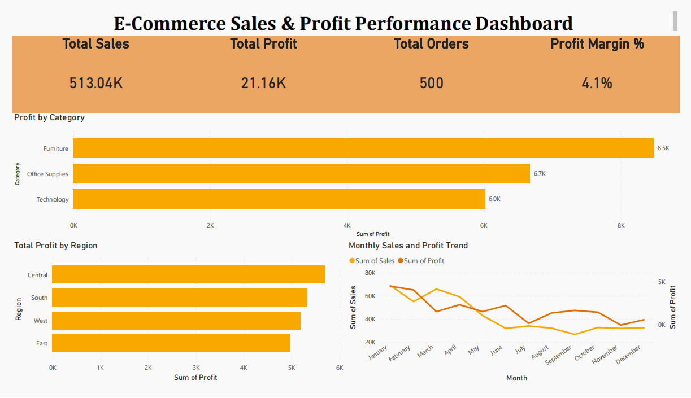

# E-Commerce Sales & Profit Analysis (SQL & Power BI)

## 📌 Project Overview
This project analyzes e-commerce sales data to evaluate overall performance, profitability trends, and key business drivers using SQL and Power BI.

## 🛠 Tools Used
- MySQL (Data analysis & querying)
- Power BI (Dashboard & visualization)
- Excel / CSV (Data source)

## 📊 Key Analysis Performed
- Total Sales, Profit, Orders, and Profit Margin KPIs
- Monthly Sales and Profit trend analysis
- Profitability by product category
- Regional profit contribution analysis

## 📈 Dashboard Preview

## 💡 Business Insights
- Furniture category contributes the highest profit
- Central region generates the highest total profit
- Profit margin remains relatively low, indicating discount impact
- Sales show seasonal fluctuations with mid-year dips

## 📎 Files Included
- `ecommerce_sales_data.csv` – dataset
- `sql_analysis.sql` – SQL queries used for analysis
- `powerbi_dashboard.png` – Power BI dashboard
